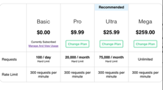
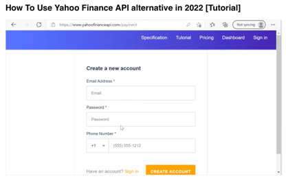
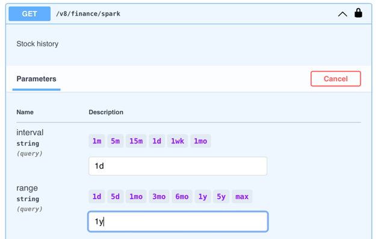
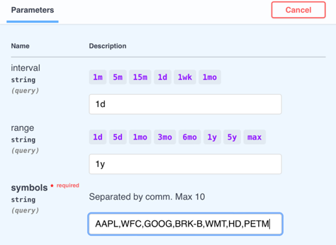
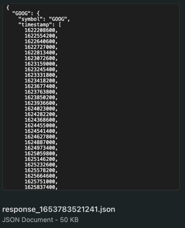

Report 1
========

| Author: Andrya Carter
| Posted: 5/28/2022
| Report 1: First Steps

This report covers activities performed between 5/23/22 – 5/29/22. This report
covers initial step of selecting an API and deciding which endpoint(s) to use
and what information can be pulled

Contents:

* API Decision
* Endpoint Selection
* Stock Selection

API Selection –
---------------
I choose to utilize the Yahoo Finance API as it allows you to 100 pulls a day on
their basic plan (free), if need be you can easily upgrade to the next plan
(Pro) that would allow you 20,000 pulls a month for $9.99. However, for this
project and what I am analyzing I believe the 100 pulls a day will be more than
plenty. I will pull the initial data and save it externally while I work to get
everything up and running. After I have it working with no errors I will switch
back to live data. Yahoo Finance API provides a nice tutorial on how to utilize
their product, this is another reason I choose to use their API.

https://www.yahoofinanceapi.com/tutorial

End Point Selection -
---------------------
For the end point I choose to utilize ``/v8/finance/spark`` which is found on
the specifications page of the Yahoo Finance API page.  This end points allows
me to select the Interval, the options are 1 minute, 5 minutes, 15 minutes, 1
day, 1 week, and 1 month. I have chosen to set my Interval at 1 day so there
for I am getting a single data point for each day. The next option is range,
the options are 1 day, 5 day, 1 month, 3 month, 6 month, 1 year, 5 year and max.
I have chosen to set my range for 1 year so I have a total of 365 days of data
(minus weekends and other days the stock market is closed).

Stock Selection –
-----------------
I choose to look at Apple, Wells Fargo, Google, Berkshire Hathaway, Walmart,
Home Depot, and Pet Smart. This is a wide range that covers multiple different
sections of the business world.

I have pulled my initial years’ worth of data. This was initially in a json
file; however, I was not able to attach that as an icon here. So, I converted
it to a word document, right now it is just 68 pages of raw data.

