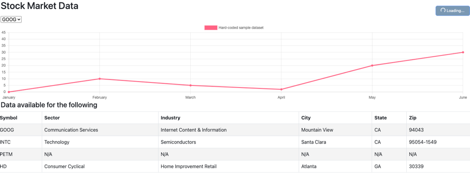

Report 10
=========

| Author: Andrya Carter
| Posted: 8/01/2022
| Report 10: Dynamic Data 2
| Hours: 10

This report covers activities performed between 7/26/22 – 8/01/22. See Summary
at the bottom for high level overview of task performed.

.. contents::

Model
-----
The goal for this week was to expose the daily price data via a rest controller.
The first step was to create a model Java object which would hold the data from
the DAILY_PRICES table.

.. code-block:: java

    public class DailyPrice {
        private Long id;
        private Long symbolId;
        private Date closingDate;
        private Double price;
    }

Rest Controller
---------------
After the model was created, I could add another method to the **RestController**
which would return all of the daily prices data. This code is very similar to the
code used for retrieving the symbols data. I was not sure if I will want to return
all of the data in one call or have method that will return the daily prices data
for a single stock symbol so I created a method for each (they are very similar).
https://mkyong.com/spring/spring-jdbctemplate-querying-examples/

.. code-block:: java

    @GetMapping(value = "/daily-prices")
    public List<Symbol> getDailyPrices() {
        List<Symbol> result = jdbcTemplate.query("SELECT * FROM DAILY_PRICES ORDER BY CLOSING_DATE", new BeanPropertyRowMapper(DailyPrice.class));
        return result;
    }

    @GetMapping(value = "/daily-prices/{symbolId}")
    public List<Symbol> getDailyPrices(@PathVariable("symbolId") Long symbolId) {
        List<Symbol> result = jdbcTemplate.query("SELECT * FROM DAILY_PRICES WHERE SYMBOL_ID = ? ORDER BY CLOSING_DATE", new Object[]{symbolId}, new BeanPropertyRowMapper(DailyPrice.class));
        return result;
    }

AJAX
----
After the data was available from the RestController, the next step was to add the Javascript code to call the new method.
Currently, I am only storing the results in a Javascript field called dailyPrices and that happens when the page is loaded.
The following webpage is helpful for performing AJAX using JQuery: https://api.jquery.com/jquery.ajax/

.. code-block:: javascript

    $.ajax({
        method: "GET",
        url: "http://localhost:8080/daily-prices",
    }).done(function (data) {
       dailyPrices = data;
    });

Refreshing Data (loading from YahooFinanceApi)
----------------------------------------------
I also hooked up the **Refresh Data** button to call the /refresh endpoint to trigger the reloading of a years worth of data
into the database.  The refresh process does not complete quickly so I used bootstrap's spinner functionality to indicate
that the process was still running.  This is accomplished by having two buttons on the page and controlling which one is
actually visible and toggling between them. The following webpages demonstrate the spinner and hiding elements:
https://getbootstrap.com/docs/4.2/components/spinners/ and https://getbootstrap.com/docs/5.0/helpers/visually-hidden/
The spinners did not want to work until I upgraded to Bootstrap 5.

.. code-block:: html

    <button class="btn btn-primary refresh-btn" type="button" onclick="refreshData()">Refresh Data</button>
    <button class="btn btn-primary refresh-btn-spinner visually-hidden" type="button" disabled>
        
        Loading...
    </button>

.. code-block:: javascript

    function refreshData() {
        $('.refresh-btn').addClass('visually-hidden');
        $('.refresh-btn-spinner').removeClass('visually-hidden');

        $.ajax({
            method: "GET",
            url: "http://localhost:8080/refresh",
        }).always(function () {
            $('.refresh-btn').removeClass('visually-hidden');
            $('.refresh-btn-spinner').addClass('visually-hidden');
        });
    }

Summary
-------
The work done for this week includes return the data from the database using a RestController
and then using Javascript to display that data in the HTML.

**Next Steps**

* Add Javascript code to swap the graph when a new symbol is selected in the drop down

Hours
-----
* RestController - 1 hours
* AJAX - 2 hours
* Refreshing Data - 5 hours
* Summary Including Documentation - 2 hours