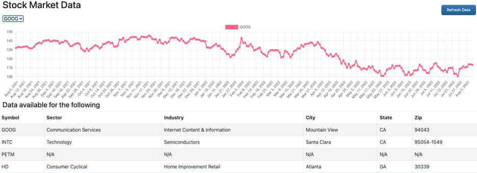
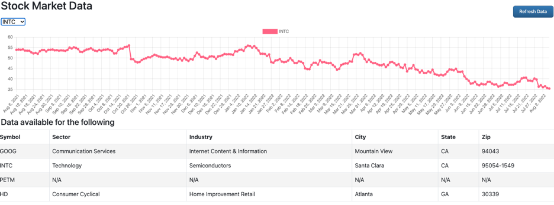
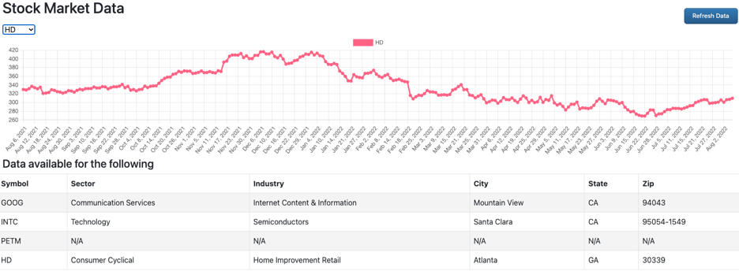

Report 11
=========

| Author: Andrya Carter
| Posted: 8/8/2022
| Report 11: Charting (chart.js)
| Hours: 10

This report covers activities performed between 8/02/22 – 8/08/22. See Summary
at the bottom for high level overview of task performed.

.. contents::

Add Dataset
-----------
In chart.js the data for the chart is located under **chart.data.datasets** and there
can be multiple datasets for a given chart. When there are multiple datasets for a
chart they will be graphed together (think multiple lines). Before data can be added
to the chart, a dataset to hold the data is required. The following code will create a
dataset record with the selected colors. I could have specified the data when creating
the dataset but I chose to create the dataset first and add data to it afterwards.

.. code-block:: javascript

    function addDataset(chart, symbol) {
        let newDataset = {
            label: symbol,
            backgroundColor: 'rgb(255, 99, 132)',
            borderColor: 'rgb(255, 99, 132)',
            data: [],
        };
        chart.data.datasets.push(newDataset);
    }

Add Data
--------
The **addData** function is used to add a single data point to the chart.  For this
I am passing in a reference to the chart, the label to display at the bottom of the
data point and the value of the data point. For the usage of this assignment I will
only ever have a single dataset displayed in the chart so I am using an index value of 0.

.. code-block:: javascript

    function addData(chart, label, data) {
        myChart.data.labels.push(label);
        myChart.data.datasets[0].data.push(data);
    }

Remove Dataset
--------------
The **removeDataset** function is used to remove a dataset from the current chart.
This is used when the stock symbol is changed and you want a completely new chart. The
following webpage was used as a guide: https://www.chartjs.org/docs/latest/developers/updates.html
however for removing the labels the code did not seem to work for me.

.. code-block:: javascript

    // the site uses
    chart.data.labels.pop();

    // however, that did not work but the following did work
    chart.data.labels = [];

.. code-block:: javascript

    function removeDataset(chart) {
        chart.data.labels = [];
        chart.data.datasets.pop();
        chart.update();
    }

Select Stock Symbol
-------------------
When the stock symbol drop down value is changed, the **selectStock** function is called.
This function orchestrates calls to the functions above in order to display the specific
stocks data in the chart. The first step consists of grabbing the selected text and value
from the symbol list select box. Then removing the existing dataset, creating a new dataset
with a label specific to the newly selected stock and finally looping over the data, identifying
the data points related to the selected stock and adding them to the dataset.

.. code-block:: javascript

    function selectStock() {
        let selectedSymbol = $('#symbolList').find(':selected').text();
        let selectedSymbolId = $('#symbolList').find(':selected').prop('value');

         removeDataset(myChart);
         addDataset(myChart, selectedSymbol);

        dailyPrices.forEach(function(dailyPrice) {
            if(dailyPrice.symbolId == selectedSymbolId) {
                let dt = new Date(dailyPrice.closingDate);
                let dtDisplay = dt.toLocaleDateString('en-us', {year:"numeric", month:"short", day:"numeric"}) ;
                 addData(myChart, dtDisplay, dailyPrice.price);
                 myChart.update();
            }
        });
    }

Initial Stock Selection
-----------------------
At this point, when I selected stock in the drop down it will render a chart of the values for that stock. However,
when the page loads nothing is displayed in the chart. In order to have the chart populated when the page initially
displays I needed to **trigger** the same **selectStock** function used when the drop down value changes. I found that
a develop can use JQuery to accomplish this behavior. The following webpage shows how to do this:
https://stackoverflow.com/questions/10547622/trigger-change-event-select-using-jquery.

.. code-block:: javascript

    $.ajax({
        method: "GET",
        url: "http://localhost:8080/daily-prices",
    }).done(function (data) {
        dailyPrices = data;
        $('#symbolList').trigger('change');  // this is the relevant line
    });

Summary
-------
The work done for this week includes having the chart update with the data for the selected stock. All of that
functionality is accomplished in Javascript. The following webpage was every helpful is getting everything to work.
https://www.chartjs.org/docs/latest/samples/line/line.html

Hours
-----
* Add Dataset - 1 hour
* Add Data - 1 hour
* Remove Dataset - 1 hour
* Select Stock Symbol - 5 hours
* Initial Stock Selection - 1 hour
* Summary Including Documentation - 1 hour