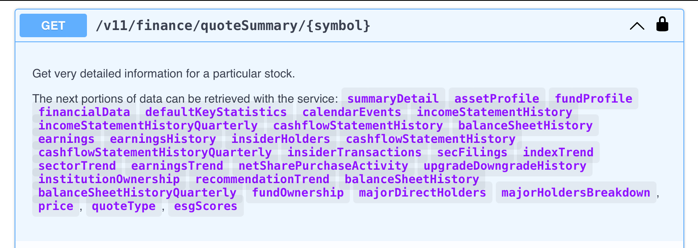
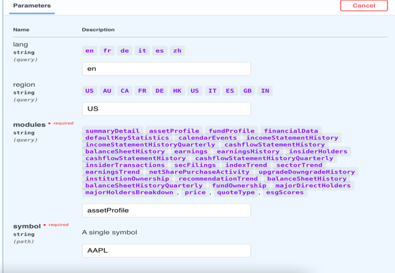
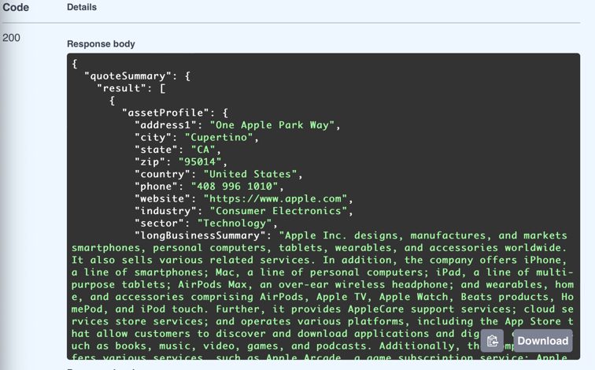
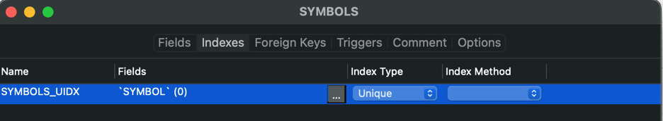
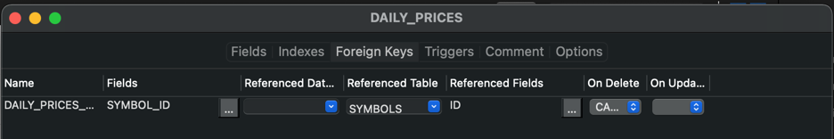
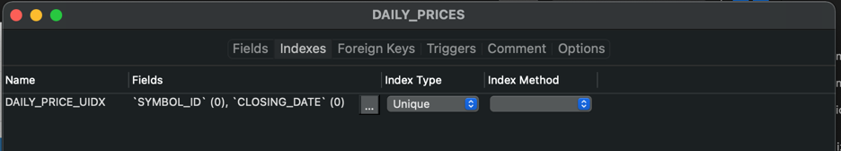
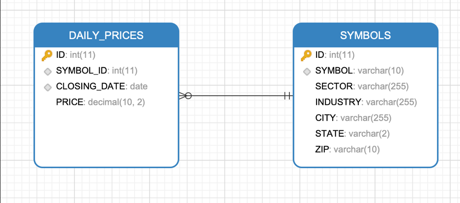

Report 2
========

| Author: Andrya Carter
| Posted: 5/28/2022
| Report 2: Next Steps

This report covers activities performed between 5/30/22 – 6/6/22. This report
covers the decision to add a second end point selection, table creation,
indexes and foreign key selection.

Contents:

* Additional Endpoint Selection
* Table creation

Additional End Point Selection -
--------------------------------
I opted to add an additional end point because I wanted/needed more than one
table for my database. The ``/v11/finance/quoteSummary/{symbol}`` will allow me to
pull additional information about the companies as well as make it more
efficient when adding and deleting a company in the future. As I can tie it to
a stock symbol and have a foreign key in place to ensure there are checks and
balances within the database.

Table Creation Steps-
---------------------
See statements below each screen shot as well as summary at the bottom. I am
utilizing Navicat to complete the data modeling.

This index prevents from duplicating stocks, if a duplicate stock is entered you
will receive a unique key exception.

Will ensure that a symbol record exist for the daily price or fails. The on
delete will clean up the daily records when a symbol is deleted.

Going to ensure that I only have one closing price for a particular stock per
day.

As stated above the additional end point allows me to have two tables, I have
from the above created indexes and foreign keys using the information pulled
from the two end points. Daily prices has a zero or many because I might have
added a new symbol without refreshing the daily prices. Symbol has to exist to
insert into daily prices and because of the foreign key there would have to be
a symbol record for every daily price and the cascade delete would remove any
daily price records when I delete a symbol.

