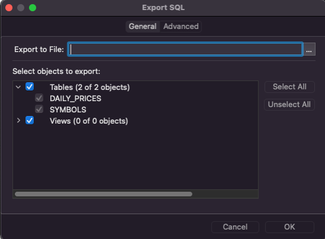
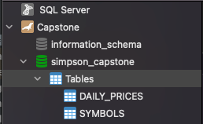

Report 3
========

| Author: Andrya Carter
| Posted: 6/13/2022
| Report 3: First Steps
| Hours: 11

This report covers activities performed between 6/7/22 – 6/13/22. This report
covers ......................

.. contents::

Creating DB & give user access
------------------------------

.. code-block:: sql

        create database simpson_capstone;
        create user simpsoncs identified by 'simpsoncspass';
        grant all on simpson_capstone.* to simpsoncs;
        flush PRIVILEGES;"

Insert tables
-------------

Utilized the "Export SQL" in the file menu of Navicat to export the tables
created last week. "Export SQL" allowed me to select the two tables and export
to the newly created DataBase. The code below is whats populated when the export
has completed.

.. code-block:: text

    --=Query Execution Started=--

    Query Succeeded: set FOREIGN_KEY_CHECKS=0

    Query Succeeded: CREATE TABLE `simpson_capstone`.`DAILY_PRICES` ( `ID` int(11)
    NOT NULL AUTO_INCREMENT, `SYMBOL_ID` int(11) NOT NULL, `CLOSING_DATE` date NOT
    NULL, `PRICE` decimal(10,2) NOT NULL, PRIMARY KEY (`ID`) , UNIQUE INDEX
    `DAILY_PRICE_UIDX` (`SYMBOL_ID` ASC, `CLOSING_DATE` ASC) )

    Query Succeeded: CREATE TABLE `simpson_capstone`.`SYMBOLS` ( `ID` int(11)
    NOT NULL AUTO_INCREMENT, `SYMBOL` varchar(10) NOT NULL, `SECTOR` varchar(255)
    NULL, `INDUSTRY` varchar(255) NULL, `CITY` varchar(255) NULL, `STATE` varchar(2)
    NULL, `ZIP` varchar(10) NULL, PRIMARY KEY (`ID`) , UNIQUE INDEX `SYMBOLS_UIDX`
    (`SYMBOL` ASC) )

    Query Succeeded: ALTER TABLE `simpson_capstone`.`DAILY_PRICES` ADD CONSTRAINT
    `DAILY_PRICES_FK1` FOREIGN KEY (`SYMBOL_ID`) REFERENCES `simpson_capstone`.
    `SYMBOLS` (`ID`) ON DELETE CASCADE

    Query Succeeded: set FOREIGN_KEY_CHECKS=1

    --=Query Execution Finished=--

Create Pom.xml
--------------

Utilized a sample Maven project from github to get started and updated the
information within the template for my project. Pom.xml is the configuration
file for a Maven project.

https://raw.githubusercontent.com/buildpacks/sample-java-app/main/pom.

.. code-block:: xml

   <?xml version="1.0" encoding="UTF-8"?>
    <project xmlns="http://maven.apache.org/POM/4.0.0" xmlns:xsi="http://www.w3.org/2001/XMLSchema-instance"
         xsi:schemaLocation="http://maven.apache.org/POM/4.0.0 http://maven.apache.org/xsd/maven-4.0.0.xsd">
    <modelVersion>4.0.0</modelVersion>
    <parent>
        <groupId>org.springframework.boot</groupId>
        <artifactId>spring-boot-starter-parent</artifactId>
        <version>2.6.8</version>
    </parent>

    <groupId>com.premier.simpson</groupId>
    <artifactId>captstone</artifactId>
    <version>0.0.1-SNAPSHOT</version>

    <name>Simpson Capstone</name>

    <properties>
        <java.version>11</java.version>
    </properties>

    <dependencies>
        <dependency>
            <groupId>org.springframework.boot</groupId>
            <artifactId>spring-boot-starter-web</artifactId>
        </dependency>

        <dependency>
            <groupId>com.fasterxml.jackson.core</groupId>
            <artifactId>jackson-databind</artifactId>
        </dependency>
    </dependencies>

    <build>
        <plugins>
            <plugin>
                <groupId>org.springframework.boot</groupId>
                <artifactId>spring-boot-maven-plugin</artifactId>
                <version>2.6.8</version>
            </plugin>
        </plugins>
    </build>
   </project>

Add Spring Web
--------------
Added spring web (spring-boot-starter-web) as a dependency in the maven pom.xml
so that I will be able to create rest controllers and run java application as a
web application.

.. code-block:: xml

     <build>
        <plugins>
            <plugin>
                <groupId>org.springframework.boot</groupId>
                <artifactId>spring-boot-maven-plugin</artifactId>
                <version>2.6.8</version>
            </plugin>
        </plugins>
     </build>

