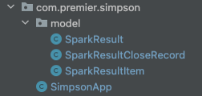

Report 4
========

| Author: Andrya Carter
| Posted: 6/20/2022
| Report 4: Spark Data
| Hours: 12.5

This report covers activities performed between 6/14/22 – 6/20/22. See Summary
at the bottom for high level overview of task performed.

.. contents::

JSON Payload
------------
I downloaded a copy of the JSON payload from YahooFinanceApi for the ``/v8/finance/spark``
request and placed the JSON file in the resources folder in my application.

Jackson-Databind
----------------
I included the Jackson-Databind dependency into the project using Maven.  This
dependency provides the ObjectMapper class that can be used to read the JSON.

This implementation was discovered during some research into handling the JSON.
The following website provided insight: https://stackoverflow.com/questions/20940769/retrieving-stock-quotes-using-yahoo-finance-api

.. code-block:: java

    ObjectMapper objectMapper = new ObjectMapper();
    URL sparkResource = SimpsonApp.class.getClassLoader().getResource("spark-response.json");
    Map<String, Map> response = objectMapper.readValue(sparkResource, Map.class);

Model Package
-------------
Now that I have figured out how to read the JSON data into my Java code, the
next step was to create a package and classes to hold the payload in a more
usable way.  I created a package called "model" and created some Java objects
that will contain the data.

I created the following classes:

* SparkResult (container for the entire payload)
* SparkResultItem (a single result of the payload)
* SparkResultCLoseRecord (join the parallel array of timestamp and close into single object)

**SparkResult**

.. code-block:: java

    public class SparkResult {
        List<SparkResultItem> items = new ArrayList<>();

        public List<SparkResultItem> getItems() {
            return items;
        }

        public void setItems(List<SparkResultItem> items) {
            this.items = items;
        }

        @Override
        public String toString() {
            return "SparkResult{" +
                    "items=" + items +
                    '}';
        }
    }

**SparkResultItem**

.. code-block:: java

    public class SparkResultItem {
        private String symbol;
        private List<SparkResultCloseRecord> records = new ArrayList<>();

        public String getSymbol() {
            return symbol;
        }

        public void setSymbol(String symbol) {
            this.symbol = symbol;
        }

        public List<SparkResultCloseRecord> getRecords() {
            return records;
        }

        public void setRecords(List<SparkResultCloseRecord> records) {
            this.records = records;
        }

        @Override
        public String toString() {
            return "SparkResultItem{" +
                    "symbol='" + symbol + '\'' +
                    ", records=" + records +
                    '}';
        }
    }

**SparkResultCloseRecord**

.. code-block:: java

    public class SparkResultCloseRecord {
        private Date date;
        private Double close;

        public Date getDate() {
            return date;
        }

        public void setDate(Date date) {
            this.date = date;
        }

        public Double getClose() {
            return close;
        }

        public void setClose(Double close) {
            this.close = close;
        }

        @Override
        public String toString() {
            return "SparkResultCloseRecord{" +
                    "date=" + date +
                    ", close=" + close +
                    '}';
        }
    }

Loading Data into Model Objects
-------------------------------
After loading the data into a Map using ObjectMapper, I looped over the results
and created instances of my model objects.  SparkResult at the highest level,
SparkResultItem for each stock symbol in the response and a SparkResultCloseRecord
for each timestamp and close price for each stock symbol.

I encountered a couple issues while writing the code to convert the raw data
into the format needed.

The first issue was when numbers did not have decimal
places.  When Jackson was reading in values, if there was a decimal it would return
the value as a Double but if there was no decimal then Jackson would return the
value as Integer.  I used "instanceof" to figure out the type of the number and
wrote code specifically for handling converting that into a type of Double.

The second issue that I encountered was when dealing with the timestamp value
which was being returned by the API.  I tried different Java Date and
Timestamp objects and none of them would return values that I was expecting.  Further
research discovered that the timestamp values from the API were not in Java format
but instead in Unix format.  Unix time is based on the number of seconds since 1970
however, Java time is based on the number of milliseconds since 1970, therefore the
value from the API needs to be multiplied by one-thousand.

https://stackoverflow.com/questions/28375648/how-are-dates-formatted-on-yahoo-finance

.. code-block::

    SparkResult result = new SparkResult();
    for (Map.Entry<String, Map> entry : response.entrySet()) {
        SparkResultItem item = new SparkResultItem();
        item.setSymbol(entry.getKey());

        List<Integer> timestamps = (ArrayList<Integer>) entry.getValue().get("timestamp");
        List<Double> closes = (ArrayList<Double>) entry.getValue().get("close");

        for( int i = 0; i < timestamps.size(); i++) {
            Integer timestamp = timestamps.get(i);
            Object close = closes.get(i);

            SparkResultCloseRecord record = new SparkResultCloseRecord();
            if(close instanceof Integer) {
                record.setClose(Double.valueOf((Integer)close));
            }

            if(close instanceof Double) {
                record.setClose((Double)close);
            }

            Date date = new Date(timestamp * 1000L);
            record.setDate(date);
            item.getRecords().add(record);
        }
        result.getItems().add(item);
    }

Summary
-------
In short, so far I have read the data from the API from a JSON file and put that
data into model objects.  The model objects are structured in a way to make the
database inserts easier.  The next step is to write the code for inserting the
data from the model objects into the database.

At this time I am researching Spring's JDBC Template since I will be able to write
SQL statements for the database operations.  https://www.baeldung.com/spring-jdbc-jdbctemplate

Hours
-----
* JSON - 30 minutes
* Jackson - 2 hours
* Model - 2 hours
* Loading - 6 hours
* Summary Including documentation - 2 hours