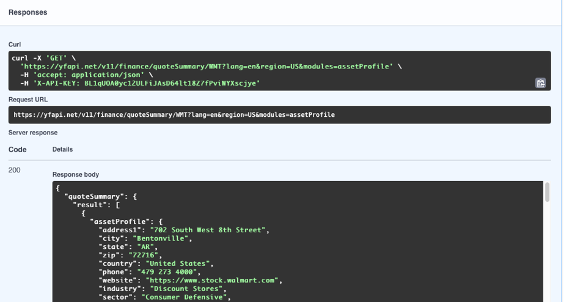

Report 6
========

| Author: Andrya Carter
| Posted: 7/4/2022
| Report 6: Calling YahooFinanceApi
| Hours: 10

This report covers activities performed between 6/28/22 – 7/4/22. See Summary
at the bottom for high level overview of task performed.

.. contents::

Call Quote Summary
------------------

I added a method for calling the quote summary api that can be used to get company
information from the YahooFinanceApi ( https://www.yahoofinanceapi.com ).  This
method first queries the database to find symbols which do not have *sector*
information.  The quote summary api only supports being called for a single
symbol so I needed to loop over the results from the database.  The call to the
api required me to set an *accept* header and a *X-API-KEY* header.  The
*X-API-KEY* header comes from the website when you create an account.

.. code-block:: java

    private void updateQuoteSummaryFromWebsite() {
        List<Map<String, Object>> results = jdbcTemplate.queryForList("select ID, SYMBOL from SYMBOLS where SECTOR is null");

        HttpHeaders headers = new HttpHeaders();
        headers.add("accept", "application/json");
        headers.add("X-API-KEY", "BL1qUOA0yc12ULFiJAsD64lt18Z7fPviWYXscjye");
        HttpEntity<Object> entity = new HttpEntity<>(headers);

        RestTemplate restTemplate = new RestTemplate();
        for (Map<String, Object> item : results) {
            Integer id = (Integer) item.get("ID");
            String symbol = (String) item.get("SYMBOL");
            ResponseEntity<Map> response = restTemplate.exchange("https://yfapi.net/v11/finance/quoteSummary/" + symbol + "?lang=en&region=US&modules=assetProfile", HttpMethod.GET, entity, Map.class);

            Map payload = response.getBody();
            Map quoteSummary = (Map) payload.get("quoteSummary");
            List result = (List) quoteSummary.get("result");
            Map assetProfile = (Map) ((Map) result.get(0)).get("assetProfile");

            String sector = (String) assetProfile.get("sector");
            String industry = (String) assetProfile.get("industry");
            String city = (String) assetProfile.get("city");
            String state = (String) assetProfile.get("state");
            String zip = (String) assetProfile.get("zip");

            jdbcTemplate.update("update SYMBOLS set SECTOR = ?, INDUSTRY = ?, CITY = ?, STATE = ?, ZIP = ? where ID = ?"
                    , sector, industry, city, state, zip, id);
        }
    }

Call Spark
----------

For retrieving the closing price information from the api, I first moved the existing
code to a new method *getSparkDataFromJson()* and then created *getSparkDataFromWebsite()*
which will do the same thing but loading it from the website instead of the static
JSON in the resources folder.  This new method queries the database to find the symbols
that I care to fetch data.  So going forward, I can just add a new symbol to the SYMBOLS
table and the data will be fetched in the next refresh.

.. code-block:: java

    private Map getSparkDataFromWebsite() {
        List<String> symbols = jdbcTemplate.queryForList("select SYMBOL from SYMBOLS", String.class);

        HttpHeaders headers = new HttpHeaders();
        headers.add("accept", "application/json");
        headers.add("X-API-KEY", "BL1qUOA0yc12ULFiJAsD64lt18Z7fPviWYXscjye");
        HttpEntity<Object> entity = new HttpEntity<>(headers);

        String payload = StringUtils.collectionToDelimitedString(symbols, ",");

        RestTemplate restTemplate = new RestTemplate();
        ResponseEntity<Map> response = restTemplate.exchange("https://yfapi.net/v8/finance/spark?interval=1d&range=1y&symbols=" + payload, HttpMethod.GET, entity, Map.class);
        return response.getBody();
    }

Summary
-------

In this report, the application now loads the data from the website and it will be
refreshed to be one year from the current date.  For the rest template calls the following
webpage was a lot of help: https://www.baeldung.com/rest-template but it did take
a lot of trial and error to get it to work.  Turns out that you cannot use headers
with the *getForObject* method and have to use the *exchange* method.

The RestController will refresh the data using the url http://localhost:8080/refresh.

**Next Steps**

* Begin work on HTML page
* Integrate the graphing Javascript library
* Use AJAX to pull in data from RestController to be used in graphing library

Hours
-----
* Call Quote Summary - 5 hours
* Call Spark - 3 hours
* Summary Including Documentation - 2 hours