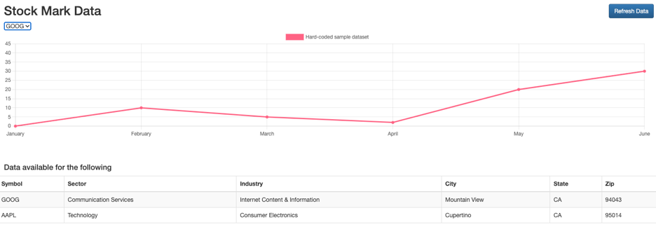

Report 7
========

| Author: Andrya Carter
| Posted: 7/11/2022
| Report 7: HTML/BOOTSTRAP
| Hours: 9

This report covers activities performed between 7/5/22 – 7/11/22. See Summary
at the bottom for high level overview of task performed.

.. contents::

Bootstrap
---------

Researched Bootstrap / Bootstrap CSS and determined that it can be used to build a
webpage using a grid layout. Bootstrap can be used for different media devices
(of different sizes) and the css classes available help design a page that would be
compatible. I have used the media sized css tags in my example.

Using Bootstrap requires the developer to include the css and Javascript which the
code for is available from this site: https://getbootstrap.com/docs/4.0/getting-started/introduction/

A sample reference for the usage of tables can be found here: https://getbootstrap.com/docs/3.4/css/#tables

.. code-block:: html

    <html lang="en">
        <head>
            <meta charset="UTF-8">
            <title>Simpson Capstone</title>
            <link rel="stylesheet" href="css/style.css">
            <!-- Latest compiled and minified CSS -->
            <link rel="stylesheet" href="https://cdn.jsdelivr.net/npm/bootstrap@3.4.1/dist/css/bootstrap.min.css" integrity="sha384-HSMxcRTRxnN+Bdg0JdbxYKrThecOKuH5zCYotlSAcp1+c8xmyTe9GYg1l9a69psu" crossorigin="anonymous">
            <!-- Optional theme -->
            <link rel="stylesheet" href="https://cdn.jsdelivr.net/npm/bootstrap@3.4.1/dist/css/bootstrap-theme.min.css" integrity="sha384-6pzBo3FDv/PJ8r2KRkGHifhEocL+1X2rVCTTkUfGk7/0pbek5mMa1upzvWbrUbOZ" crossorigin="anonymous">
            <!-- Latest compiled and minified JavaScript -->
            
            
            
            
        </head>

.. code-block:: html

        <body>
            

                

                    

                        <h2>Stock Mark Data</h2>
                    

                    

                        <button class="btn btn-primary refresh-btn" type="button">Refresh Data</button>
                    

                

                

                    

                        <select>
                            <option>GOOG</option>
                            <option>AAPL</option>
                        </select>
                    

                

                

                    

                        <canvas height="50" id="myChart"></canvas>
                    

                

                

                    
<h4>Data available for the following</h4>

                    <table class="table table-striped table-bordered">
                        <thead>
                            <tr>
                                <th>Symbol</th>
                                <th>Sector</th>
                                <th>Industry</th>
                                <th>City</th>
                                <th>State</th>
                                <th>Zip</th>
                            </tr>
                        </thead>
                        <tbody>
                            <tr>
                                <td>GOOG</td>
                                <td>Communication Services</td>
                                <td>Internet Content &amp; Information</td>
                                <td>Mountain View</td>
                                <td>CA</td>
                                <td>94043</td>
                            </tr>
                            <tr>
                                <td>AAPL</td>
                                <td>Technology</td>
                                <td>Consumer Electronics</td>
                                <td>Cupertino</td>
                                <td>CA</td>
                                <td>95014</td>
                            </tr>
                        </tbody>
                    </table>
                

            

        </body>

Chart.js
--------

There was a sample implementation for chart.js on their webpage: https://www.chartjs.org/docs/latest/getting-started/usage.html
which I used in the mockup.  Using chart.js required the usage of a *canvas* tag
which I have never used before but from what I read seems to be related to HTML5.

.. code-block:: html

    

        <canvas height="50" id="myChart"></canvas>
    

After the canvas tag is on the page, I was able to use Javascript to initialize the
graph with some hard coded data.

.. code-block:: js

    const labels = [
        'January',
        'February',
        'March',
        'April',
        'May',
        'June',
    ];

    const data = {
        labels: labels,
        datasets: [{
            label: 'Hard-coded sample dataset',
            backgroundColor: 'rgb(255, 99, 132)',
            borderColor: 'rgb(255, 99, 132)',
            data: [0, 10, 5, 2, 20, 30, 45],
        }]
    };

    const config = {
        type: 'line',
        data: data,
        options: {}
    };

    $( document ).ready(function() {
        const myChart = new Chart(
            document.getElementById('myChart'),
            config
        );
    });

Page Layout
-----------

I designed the page layout to include a drop down of all symbols available for
graphing. The idea is that when the drop down value changes, the graph will update
to the corresponding data. Below the graph is a table that displays all symbols
and there company data (all from the symbols table). There is also a button called
*Refresh Data* in the upper right which when clicked will call the refresh method
in the controller and call out to YahooFinanceApi to retrieve the latest data.

Summary
-------

The work done for this week and this report only includes mocked data and non-functional
HTML inputs/buttons.

**Next Steps**

* Have the Refresh Data button call the refresh endpoint
* Create RestController endpoint for retrieving SYMBOLS data
* Make AJAX call to get SYMBOLS data and update the webpage with the data
* Create RestController endpoint for retrieving DAILY_PRICE data
* Make AJAX call to get DAILY_PRICE data
* Add Javascript code to swap the graph when a new symbol is selected in the drop down

Hours
-----
* Bootstrap - 3 hours
* Chart.js - 1 hours
* Page Layout - 3 hours
* Summary Including Documentation - 2 hours